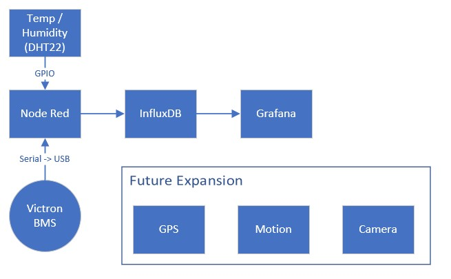
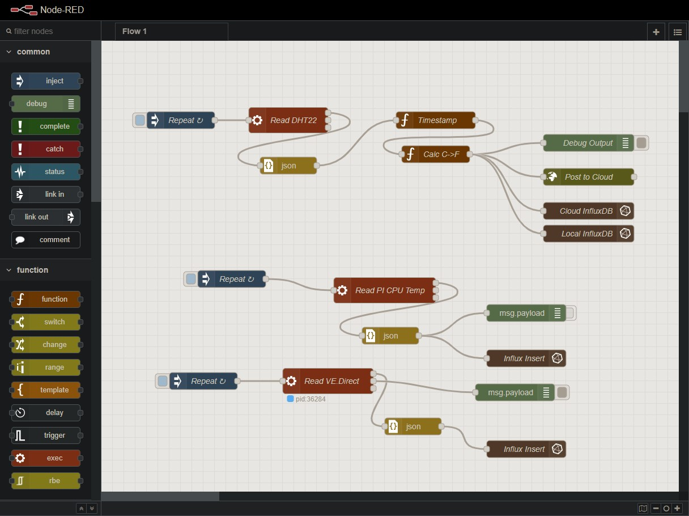
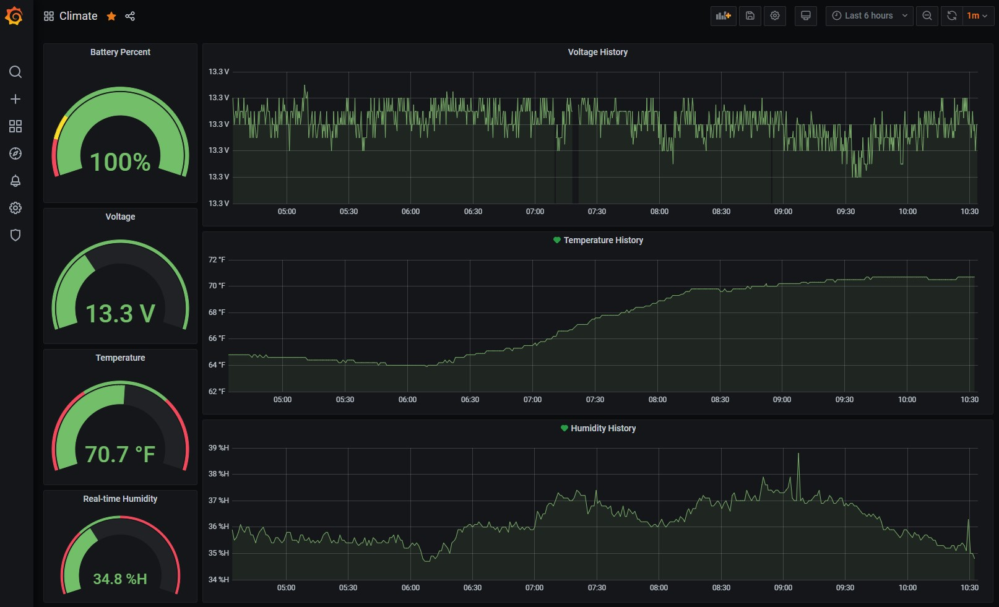
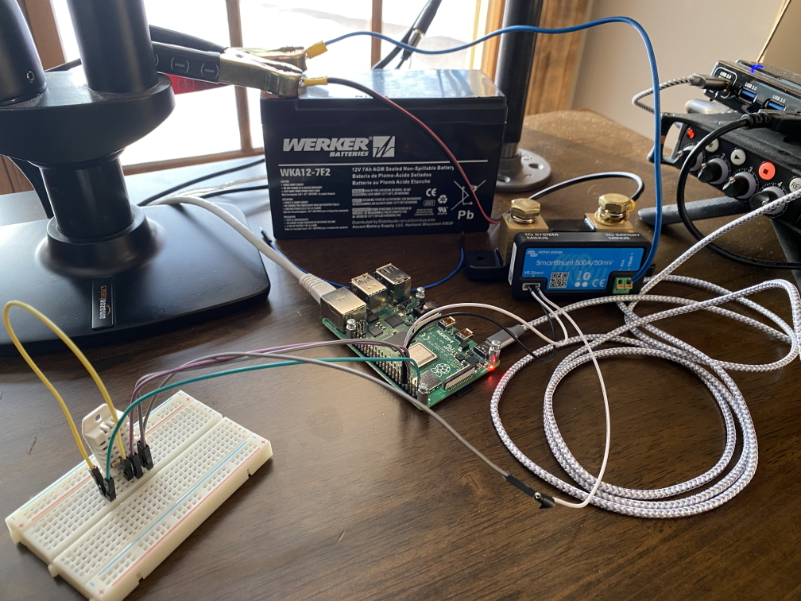

# RV IoT
## Remote Monitoring of Your RV via Raspberry Pi

This project is to IoT enable my RV (Travel trailer). A Raspberry Pi communicates with various sensors to report temperature and humidity. There is also an interface to the [Victron Smart Shunt](https://amzn.to/3bBpdeS), allowing the detailed monitoring of power usage.

Since the Pi has Wi-Fi, I'm able to connect it to a Wi-Fi hotspot, and remotely monitor the RV for the following use cases:

* Monitor the climate while we're away from our pets
* Monitor the battery level while in storage (note: be sure to have a way to keep the Pi powered and your batteries topped off)

I'm working on a couple of different techniques for storing/accessing in the cloud, but I also have a working prototype of Influx and Grafana installed on the Pi itself. I can then access it all in remote locations, and use WireGuard to access remotely.

## Quick Setup

1. Flash your Raspberry Pi 3/4 with the [Raspberry Pi Imager](https://www.raspberrypi.org/software/)
1. Run the commands in [prep-pi.sh](prep-pi.sh)
1. Navigate to <pi_ip_address>:1880 to access Node Red
    * todo: instructions to set up node red
1. Navigate to <pi_ip_address>:3000 to access Grafana
    * todo: instructions to set up Grafana

## Architecture

## Reporting

## Prototype

## Dev

Restarting Telegraf:
`systemctl restart telegraf.service`

Viewing Telegraf logs:
`journalctl -u telegraf.service --no-pager`